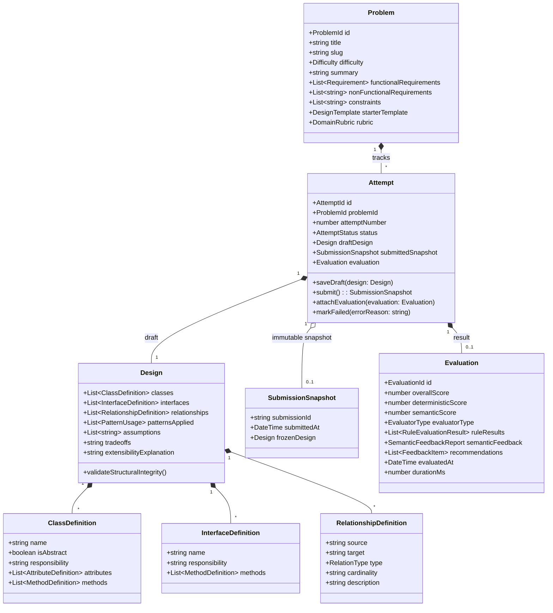
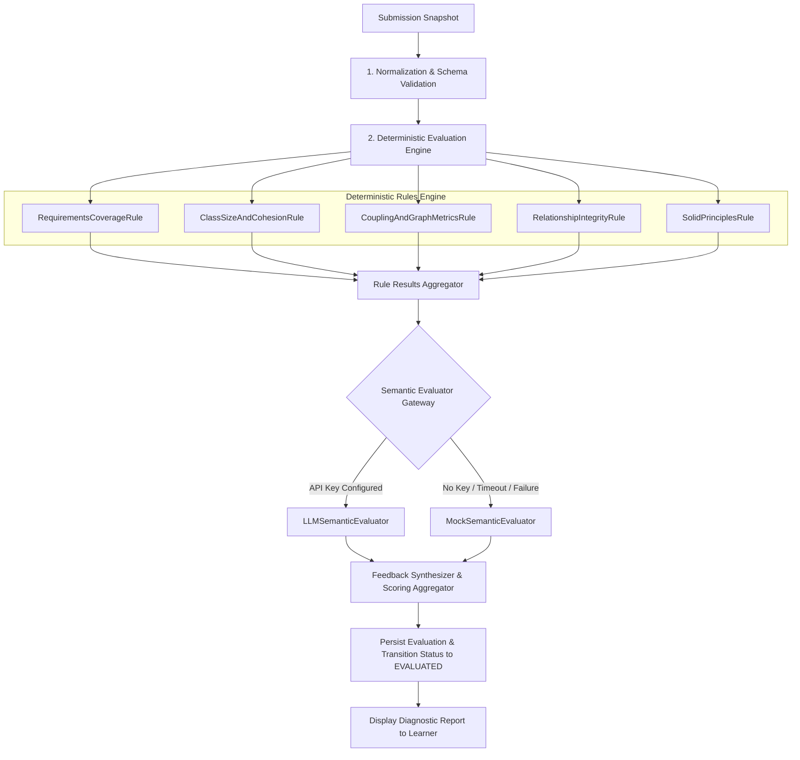
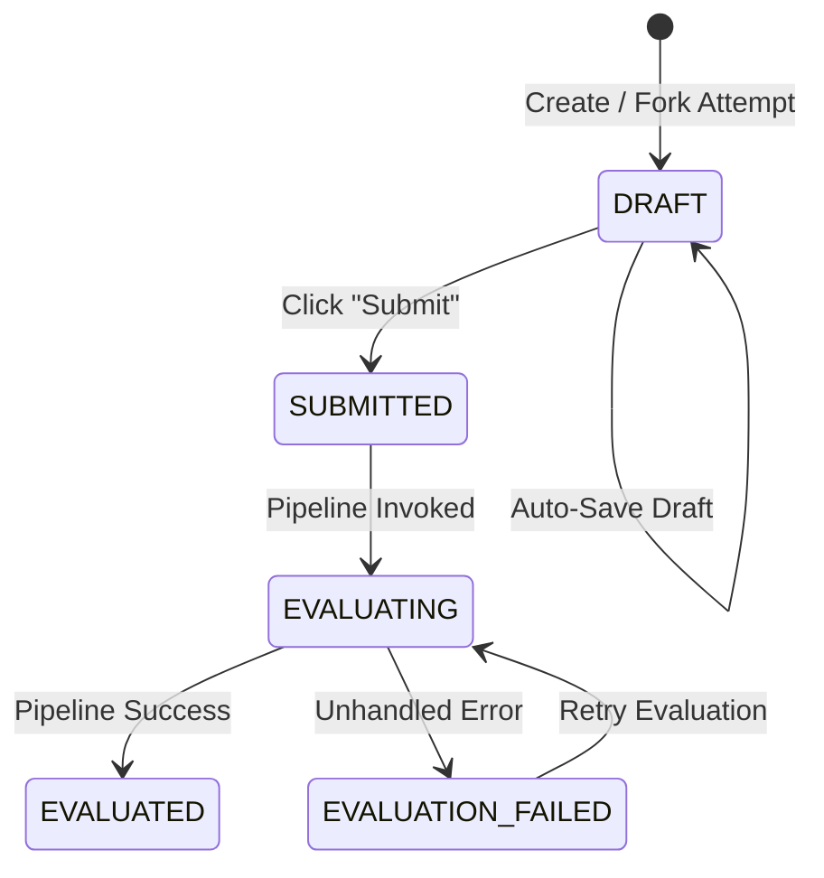

# System Design & Architecture: LLD Arena

## 1. Product Overview

**LLD Arena** is an interactive, deliberate-practice platform for Low-Level and Object-Oriented Design. It replaces passive reading with an active, structured modeling and evaluation feedback loop.

### Core Value Proposition
- **Structured Architectural Modeling:** Learners declare classes, interfaces, attributes, methods, responsibilities, relationships, design patterns, assumptions, and trade-offs.
- **Hybrid Multi-Stage Evaluation:** Combines deterministic structural linting/graph analysis with semantic qualitative evaluation.
- **No Canonical Solution Lock-in:** Multiple architectural paradigms (e.g., Strategy vs. State vs. Event-driven) are fairly graded based on cohesion, coupling, requirements coverage, and sound reasoning.
- **Iterative Learning & Diffing:** Attempt history tracks architectural metrics across iterations (e.g., reduction in coupling, elimination of god classes).

---

## 2. User Journey & Core Flows

```
[ Problem Library ]
        │  Select Problem (e.g., Parking Lot, Elevator System, Rate Limiter)
        ▼
[ Problem Detail ]
        │  Inspect Functional Requirements, NFRs, Constraints, Domain Hints
        ▼
[ Design Workspace ] ◄────────────────────────┐
   ├── Structured Class & Interface Modeler   │
   ├── Relationship & Cardinality Builder     │
   ├── Pattern, Trade-offs & Notes Editor     │ (Draft Auto-Save)
   └── Live Mermaid UML Diagram Preview       │
        │                                     │
        ▼ (Submit Action)                     │
[ Submission & Evaluation ]                   │
   ├── Snapshot Frozen (Immutable)            │
   ├── Deterministic Rules Execution          │
   └── Semantic Reasoning Assessment          │
        │                                     │
        ▼                                     │
[ Evaluation & Feedback View ]                │
   ├── Multi-Dimensional Score Radar          │
   ├── Deterministic Violations & Praise      │
   ├── Qualitative Trade-off Critique         │
   └── Actionable Refactoring Recommendations │
        │                                     │
        ▼                                     │
[ Revise & Try Again ] ───────────────────────┘
        │ (Creates Attempt N+1 prefilled with Attempt N)
        ▼
[ Attempt History & Comparison View ]
   └── Visual diff of design changes and metric improvements
```

---

## 3. Domain Model

The domain is organized according to Domain-Driven Design (DDD) principles with well-defined Aggregates, Entities, and Value Objects.



### Invariants & Business Rules
1. **Draft Mutability:** An `Attempt` in `DRAFT` status allows free updates to `draftDesign`.
2. **Snapshot Immutability:** Once submitted, `draftDesign` is deep-copied into an immutable `SubmissionSnapshot`. Any subsequent edits require starting a new attempt (`attemptNumber = previous + 1`).
3. **Valid Relationships:** A `RelationshipDefinition` source and target must exist within the declared classes or interfaces of the design.
4. **Non-Dangling References:** Interface realization targets must exist in `interfaces`. Inheritance targets must exist in `classes`.
5. **Acyclic Inheritance:** Class inheritance graphs must be directed acyclic graphs (DAGs).

---

## 4. Evaluation Architecture

### The "Multiple Valid Solutions" Philosophy
In LLD, canonical string or exact AST matching is an anti-pattern. A Parking Lot can legitimately use:
- A flat `Slot` hierarchy with `VehicleType` enums, OR
- A polymorphic `ParkingSpot` hierarchy (`CompactSpot`, `HandicappedSpot`, `LargeSpot`), OR
- A strategy-based `AllocationStrategy` decoupled from the spot itself.

Our evaluation pipeline evaluates **principles**, **metrics**, and **intent** rather than specific names.

### Evaluation Pipeline Flow


### Important Interfaces & Classes

#### `EvaluationRule` Interface
```typescript
export interface EvaluationRule {
  readonly id: string;
  readonly name: string;
  readonly category: FeedbackCategory;
  readonly weight: number; // 0.0 to 1.0

  evaluate(context: EvaluationContext): Promise<RuleEvaluationResult>;
}

export interface EvaluationContext {
  problem: Problem;
  design: Design;
}

export interface RuleEvaluationResult {
  ruleId: string;
  score: number; // 0 to 100
  passed: boolean;
  metrics?: Record<string, number | string>;
  feedback: FeedbackItem[];
}
```

#### Deterministic Rules
1. **`RequirementsCoverageRule`:** Matches functional requirements against class responsibilities and method names using semantic keyword/intent matching.
2. **`ClassSizeAndCohesionRule`:** Flags "God Classes" (>7 methods or >5 attributes without helper separation) and empty responsibilities.
3. **`CouplingAndGraphMetricsRule`:** Computes Fan-in (Afferent) and Fan-out (Efferent) coupling. Flags excessive coupling (`Efferent > 4` on non-facade classes).
4. **`RelationshipIntegrityRule`:** Validates reference existence, prevents cyclic inheritance, and checks for appropriate relationship types (e.g., composition vs. association).
5. **`SolidPrinciplesRule`:** Checks for Dependency Inversion (high-level classes depending directly on concrete leaf implementations without interfaces) and Interface Segregation (fat interfaces).

#### `SemanticEvaluator` Interface
```typescript
export interface SemanticEvaluator {
  evaluate(context: EvaluationContext, deterministicSummary: RuleEvaluationResult[]): Promise<SemanticEvaluationReport>;
}
```
- **`LLMSemanticEvaluator`:** Calls an external LLM (e.g., Claude, OpenAI, or Gemini) using a structured prompt with few-shot guidance. Evaluates abstraction quality, design patterns, trade-offs, and extensibility.
- **`MockSemanticEvaluator`:** Operates 100% offline with zero external dependencies. Uses rule-based heuristics to analyze design patterns, check stated assumptions, and generate structured feedback.

---

## 5. Persistence Model (SQLite)

We use SQLite via `better-sqlite3` in WAL mode. SQLite is zero-maintenance, serverless, transactional, and runs identically across all developer environments.

### Schema Definition
```sql
CREATE TABLE IF NOT EXISTS problems (
  id TEXT PRIMARY KEY,
  slug TEXT UNIQUE NOT NULL,
  title TEXT NOT NULL,
  difficulty TEXT NOT NULL,
  summary TEXT NOT NULL,
  functional_requirements TEXT NOT NULL, -- JSON array
  non_functional_requirements TEXT NOT NULL, -- JSON array
  constraints TEXT NOT NULL, -- JSON array
  starter_template TEXT NOT NULL, -- JSON object
  domain_rubric TEXT NOT NULL, -- JSON object
  created_at DATETIME DEFAULT CURRENT_TIMESTAMP
);

CREATE TABLE IF NOT EXISTS attempts (
  id TEXT PRIMARY KEY,
  problem_id TEXT NOT NULL,
  attempt_number INTEGER NOT NULL,
  status TEXT NOT NULL, -- DRAFT, SUBMITTED, EVALUATING, EVALUATED, EVALUATION_FAILED
  draft_design TEXT NOT NULL, -- JSON object
  submitted_snapshot TEXT, -- JSON object (null when DRAFT)
  created_at DATETIME DEFAULT CURRENT_TIMESTAMP,
  updated_at DATETIME DEFAULT CURRENT_TIMESTAMP,
  submitted_at DATETIME,
  FOREIGN KEY (problem_id) REFERENCES problems(id)
);

CREATE TABLE IF NOT EXISTS evaluations (
  id TEXT PRIMARY KEY,
  attempt_id TEXT NOT NULL UNIQUE,
  overall_score REAL NOT NULL,
  deterministic_score REAL NOT NULL,
  semantic_score REAL NOT NULL,
  evaluator_type TEXT NOT NULL, -- HYBRID_LLM, HYBRID_MOCK, DETERMINISTIC_ONLY
  rule_results TEXT NOT NULL, -- JSON array
  semantic_feedback TEXT NOT NULL, -- JSON object
  recommendations TEXT NOT NULL, -- JSON array
  execution_duration_ms INTEGER NOT NULL,
  created_at DATETIME DEFAULT CURRENT_TIMESTAMP,
  FOREIGN KEY (attempt_id) REFERENCES attempts(id)
);
```

---

## 6. Submission Lifecycle & Failure Handling

### State Machine


### Safety & Resilience Guarantees
1. **Zero Data Loss:** When the user clicks "Submit", the current state is committed to SQLite as `SUBMITTED` with the full `submitted_snapshot` before evaluation begins.
2. **Semantic Fallback:** If the LLM call times out (5-second threshold), returns a 429/500, or fails validation, the pipeline catches the error and silently falls back to `MockSemanticEvaluator`. The evaluation still succeeds and returns actionable feedback.
3. **Pipeline Isolation:** Each evaluation rule runs in an isolated `try/catch` block. A failure in an individual rule records a failed rule result without crashing the overall evaluation pipeline.
4. **Idempotent Retries:** If a submission ends in `EVALUATION_FAILED`, the learner or system can trigger `/api/attempts/:id/retry` without re-uploading the design.

---

## 7. API Boundaries (REST Contract)

| Method | Endpoint | Description |
| :--- | :--- | :--- |
| `GET` | `/api/problems` | List all available problems with user attempt summaries |
| `GET` | `/api/problems/:slug` | Get complete problem details and starter template |
| `POST` | `/api/problems/:slug/attempts` | Create a new attempt (or fork from a previous attempt) |
| `GET` | `/api/attempts/:id` | Get attempt details (draft, submission, evaluation) |
| `PUT` | `/api/attempts/:id/draft` | Update draft design (auto-save) |
| `POST` | `/api/attempts/:id/submit` | Finalize design snapshot and trigger evaluation pipeline |
| `GET` | `/api/attempts/:id/evaluation` | Retrieve detailed evaluation report |
| `POST` | `/api/attempts/:id/retry` | Retry evaluation if previous execution failed |
| `GET` | `/api/problems/:slug/attempts` | Get attempt history for a specific problem |
| `GET` | `/api/attempts/compare` | Query params `?baseId=...&targetId=...` for side-by-side diff |

---

## 8. UX Structure (7 Distinct Screens)

1. **Problem Library:** Grid of problems showing difficulty badges, domain tags, completion status, and personal highest score.
2. **Problem Detail:** Problem description, functional & non-functional requirements, constraints, architectural hints, and "Start Attempt" button.
3. **Design Workspace:** 3-pane workbench:
   - *Left pane:* Collapsible requirements checklist.
   - *Center pane:* Structured builder tabs (Classes, Interfaces, Relationships, Design Patterns, Notes).
   - *Right pane:* Live Mermaid UML diagram rendering, JSON inspector, auto-save status indicator, and Submit button.
4. **Submission Status:** Real-time visual pipeline showing progress stages: Validating -> Deterministic Analysis -> Semantic Synthesis.
5. **Evaluation / Feedback:** Comprehensive feedback dashboard:
   - Score overview (Overall, Deterministic, Semantic).
   - Category breakdowns (Requirements, Coupling, Cohesion, SOLID, Patterns).
   - Concrete violation cards with "Why this matters" and "How to fix".
   - Stated trade-offs critique and alternative design recommendations.
   - "Revise in New Attempt" primary action button.
6. **Attempt History:** Timeline of all attempts for the current problem, displaying date, score, number of classes, and status.
7. **Attempt Comparison / Improvement:** Side-by-side comparative diff between Attempt $N$ and Attempt $N+1$, highlighting added/removed entities, resolved warnings, and metric improvements.

---

## 9. Testing Strategy

1. **Unit Tests (Domain & Rules):**
   - Invariants of `Attempt` and `Design` entities.
   - `RequirementsCoverageRule`: Matches classes to requirements correctly.
   - `CouplingAndGraphMetricsRule`: Computes Fan-in / Fan-out and identifies high coupling.
   - `ClassSizeAndCohesionRule`: Accurately flags god classes and missing responsibilities.
   - `RelationshipIntegrityRule`: Detects cycles and dangling references.
2. **Integration Tests (Pipeline & Persistence):**
   - End-to-end `EvaluationPipeline` execution with `MockSemanticEvaluator`.
   - LLM fallback test: Assert pipeline completes gracefully when external LLM throws an error.
   - SQLite repository CRUD and state transition transactions.
3. **API Contract Tests:**
   - Full lifecycle test: `Create Attempt -> Save Draft -> Submit -> Poll Status -> Fetch Evaluation -> Fork Attempt`.

---

## 10. Key Trade-offs & Design Decisions

| Decision | Chosen Approach | Alternative Considered | Rationale |
| :--- | :--- | :--- | :--- |
| **Input Format** | Structured Entity/Relationship Schema | Free-form Java / Python code | Free-form code requires complex AST parsers and compilation sandboxes, focusing on syntax rather than architectural thinking. Structured schema allows instant graph analysis and dynamic UML generation. |
| **Execution Model** | In-process Asynchronous Pipeline | Distributed Queue (Kafka / BullMQ) | In a 2-day scope, distributed workers add operational failure modes with zero benefit. In-process promises execute in 1-2s and run locally without extra daemons. |
| **Diagram Generation** | Client-side Mermaid.js | Custom HTML5 Canvas / D3 / React Flow | Custom drag-and-drop canvas requires significant UI effort. Mermaid.js renders standard UML class diagrams reliably directly from schema JSON. |
| **Evaluation Strategy** | Hybrid (Deterministic Rules + Semantic) | Pure LLM Evaluation | Pure LLM is slow, non-deterministic, hallucinates rules, and fails offline. Deterministic rules provide rock-solid architectural verification. |

---

## 11. What We Explicitly Will NOT Build

To maintain engineering discipline and guarantee a high-quality 2-day delivery, the following are intentionally excluded:
- **No Kubernetes, Docker Swarms, or Cloud Infrastructure:** The entire app runs locally with `npm run dev`.
- **No Multi-Tenant User Authentication:** Single-user local profile / session without OAuth or passwords.
- **No Code Compilation Sandbox:** No executing user-submitted Java/C++ binaries in Docker containers.
- **No Distributed Message Brokers:** No Kafka, RabbitMQ, or Celery.
- **No Complex Drag-and-Drop Node Diagram Editor:** UML is generated automatically and declaratively from the structured design.

---

## 12. Future Extensions
- Export to PlantUML and raw code skeletons (Java, C++, TypeScript).
- Collaborative multiplayer design reviews via WebSockets.
- Expanded problem library (Distributed Cache, Rate Limiter with Redis, Pub-Sub Broker).
- Interactive interview simulation mode with follow-up requirement curveballs ("Now scale to 100k requests/sec").
